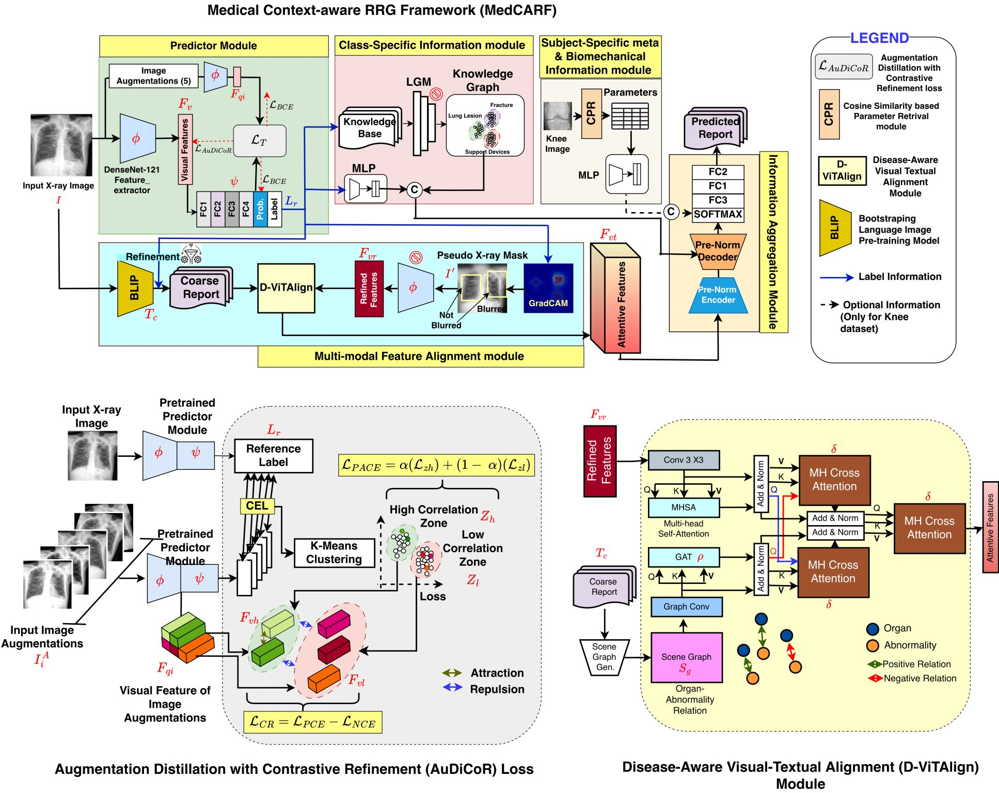

This repo contains the Official Pytorch implementation of our work:

"Unsupervised Contrastive Refinement with Graph-Aware Multimodal Interaction for Radiology Report Generation" published at IEEE Journal of Biomedical and Health Informatics.

 Schematic of Medical Context-aware RRG Framework (MedCARF) architecture with proposed Disease-aware Visual Teaxual Alignement (D-ViTAlign) Module and Augmentation Distillation with Contrastive Refinement (AuDiCoR) loss.  

Cite the article:

  @ARTICLE{11420997,
  author={Daydar, Akshay and Reddy, Chenna Keshava and Kumar, Sonal and Laskar, Hanif and Sur, Arijit and Kanagaraj, Subramani},
  journal={IEEE Journal of Biomedical and Health Informatics}, 
  title={Unsupervised Contrastive Refinement with Graph-Aware Multimodal Interaction for Radiology Report Generation}, 
  year={2026},
  volume={},
  number={},
  pages={1-12},
  keywords={Visualization;X-ray imaging;Biomechanics;Radiology;Pipelines;Accuracy;Medical diagnostic imaging;Knee;Diseases;Training;cross-modal interactions;label refinement;contrastive loss;multimodal;biomechanical data},
  doi={10.1109/JBHI.2026.3670375}}

Requirements

    Linux
    Python3 3.8.10
    Pytorch 1.13.1
    train and test with A100 GPU
